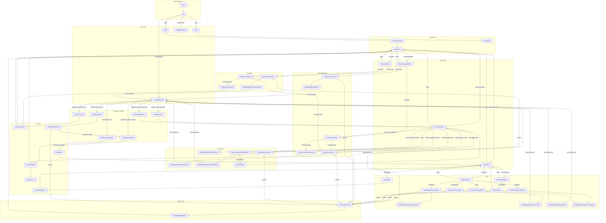

```mermaid
graph TD
    subgraph "User Interaction"
        direction LR
        A[User] --> B{Bot}
    end

    subgraph "Bot Logic"
        direction TB
        B -- /start --> Start
        B -- /help --> Help
        B -- Text Message --> MessageHandler
        B -- Button Click --> CallbackHandler
    end

    subgraph "Commands"
        Start --> ResetUserState
        ResetUserState --> MainMenu
        Help --> ShowHelp
    end

    subgraph "Main Menu"
        MainMenu -- "Current weather" --> CurrentWeatherMenu
        MainMenu -- "Forecast" --> ForecastMenu
        MainMenu -- "Interested towns" --> MyTownsMenu
        MainMenu -- "Weather Alerts" --> AlertsMenu
    end

    subgraph "Current Weather"
        CurrentWeatherMenu -- "For any city" --> AskForCity_Current
        CurrentWeatherMenu -- "For home" --> GetWeatherHome
        CurrentWeatherMenu -- "Back" --> MainMenu
        AskForCity_Current --> SetWaitingForCityState
        SetWaitingForCityState -- User sends city --> MessageHandler
        GetWeatherHome -- No home town --> AskForHomeTown
        GetWeatherHome -- Home town set --> FetchCurrentWeatherHome
    end

    subgraph "Forecast"
        ForecastMenu -- "For any city" --> AskForCity_Forecast
        ForecastMenu -- "For home" --> GetForecastHome
        ForecastMenu -- "Back" --> MainMenu
        AskForCity_Forecast --> SetWaitingForForecastCityState
        SetWaitingForForecastCityState -- User sends city --> MessageHandler
        GetForecastHome -- No home town --> AskForHomeTown
        GetForecastHome -- Home town set --> FetchForecastHome
    end

    subgraph "My Towns"
        MyTownsMenu -- "Set Home Town" --> AskForHomeTown
        MyTownsMenu -- "Change Home Town" --> AskForHomeTown
        MyTownsMenu -- "Add Interested Town" --> AskForInterestedTown
        MyTownsMenu -- "Remove Interested Town" --> RemoveInterestedTownMenu
        MyTownsMenu -- "View Home Weather" --> GetWeatherHome
        MyTownsMenu -- "Back" --> MainMenu
        MyTownsMenu -- "Interested Town Button" --> GetWeatherForInterestedTown

        AskForHomeTown --> SetWaitingForHomeTownState
        SetWaitingForHomeTownState -- User sends city --> MessageHandler
        AskForInterestedTown --> SetWaitingForInterestedTownState
        SetWaitingForInterestedTownState -- User sends city --> MessageHandler
        RemoveInterestedTownMenu -- "Town Button" --> RemoveTown
        RemoveInterestedTownMenu -- "Back" --> MyTownsMenu
    end

    subgraph "Alerts"
        AlertsMenu -- "Add Alert" --> AddAlertMenu
        AlertsMenu -- "Remove Alert" --> RemoveAlertMenu
        AlertsMenu -- "Check Alert" --> CheckAlert
        AlertsMenu -- "Back" --> MainMenu

        AddAlertMenu -- "Standard" --> AskForAlertCity_Standard
        AddAlertMenu -- "Temperature" --> AskForAlertCity_Temp
        AddAlertMenu -- "Wind" --> AskForAlertCity_Wind
        AddAlertMenu -- "Humidity" --> AskForAlertCity_Humidity
        AddAlertMenu -- "Back" --> AlertsMenu

        AskForAlertCity_Standard --> SetWaitingForAlertCity_Standard
        SetWaitingForAlertCity_Standard -- User sends city --> MessageHandler
        AskForAlertCity_Temp --> SetWaitingForAlertCity_Temp
        SetWaitingForAlertCity_Temp -- User sends city --> MessageHandler
        AskForAlertCity_Wind --> SetWaitingForAlertCity_Wind
        SetWaitingForAlertCity_Wind -- User sends city --> MessageHandler
        AskForAlertCity_Humidity --> SetWaitingForAlertCity_Humidity
        SetWaitingForAlertCity_Humidity -- User sends city --> MessageHandler

        RemoveAlertMenu -- "Alert Button" --> RemoveAlert
        RemoveAlertMenu -- "Back" --> AlertsMenu
    end

    subgraph "Message Handler"
        MessageHandler -- waiting_for_city --> FetchCurrentWeather
        MessageHandler -- waiting_for_forecast_city --> FetchForecast
        MessageHandler -- waiting_for_home_town --> SetHomeTown
        MessageHandler -- waiting_for_interested_town --> AddInterestedTown
        MessageHandler -- waiting_for_alert_city --> HandleAlertCity
        MessageHandler -- waiting_for_alert_params --> HandleAlertParams
    end

    subgraph "Actions"
        FetchCurrentWeather --> ShowWeather --> MainMenu
        FetchForecast --> ShowForecast --> MainMenu
        FetchCurrentWeatherHome --> ShowWeather --> MainM_en_u
        FetchForecastHome --> ShowForecast --> MainMenu
        SetHomeTown --> MyTownsMenu
        AddInterestedTown --> MyTownsMenu
        RemoveTown --> MyTownsMenu
        HandleAlertCity --> AskForAlertParams
        AskForAlertParams -- User sends value --> HandleAlertParams
        HandleAlertParams -- All params collected --> CreateAlert --> AlertsMenu
        CheckAlert --> ShowAlertStatus --> AlertsMenu
        RemoveAlert --> AlertsMenu
    end

    subgraph "Cancel Flow"
        AskForCity_Current -- "Cancel" --> CancelOperation
        AskForCity_Forecast -- "Cancel" --> CancelOperation
        AskForHomeTown -- "Cancel" --> CancelOperation
        AskForInterestedTown -- "Cancel" --> CancelOperation
        AskForAlertCity_Standard -- "Cancel" --> CancelOperation
        AskForAlertCity_Temp -- "Cancel" --> CancelOperation
        AskForAlertCity_Wind -- "Cancel" --> CancelOperation
        AskForAlertCity_Humidity -- "Cancel" --> CancelOperation
        AskForAlertParams -- "Cancel" --> CancelOperation
        CancelOperation --> ResetAllWaitingStates --> MainMenu
    end
``` 